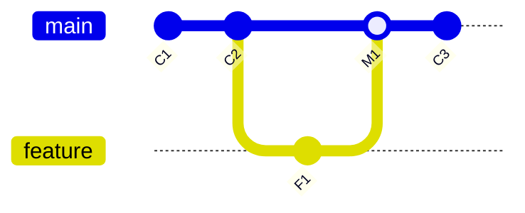

# Git Graph 렌더링 알고리즘 설명

`gitbbon-manager`에서 구현한 Git Graph는 커밋 히스토리를 시각적으로 표현하기 위해 "레인(Lane) 기반 알고리즘"을 사용합니다. 이 문서에서는 그 작동 원리를 단계별로 설명합니다.

## 1. 핵심 개념: 레인 (Lane)

Git 그래프는 2차원 그리드입니다.
- **Y축 (행)**: 시간 순서대로 정렬된 커밋들 (최신이 위)
- **X축 (열)**: 브랜치나 흐름을 나타내는 "레인(Lane)"

각 커밋과 그 사이를 잇는 선들은 이 레인 위에 배치됩니다. 알고리즘의 핵심은 **"각 커밋을 어느 레인에 두고, 부모와 어떻게 연결할 것인가?"**를 결정하는 것입니다.

## 2. 데이터 준비

Git 로그를 통해 다음과 같은 정보를 가져옵니다:
- **Hash**: 커밋 아이디
- **Parents**: 부모 커밋들의 해시 (1개면 일반 커밋, 2개 이상이면 머지 커밋)
- **Refs**: 브랜치 이름, 태그 등

## 3. 알고리즘: 한 줄씩 내려가며 그리기

그래프는 가장 최신 커밋(맨 위)부터 시작해서 과거(아래)로 내려가며 그립니다. 이때 `activeLanes`(활성 레인)라는 상태를 유지하며 추적합니다.

### 3.1 `activeLanes` (활성 레인)
`activeLanes`는 **"현재 행을 지나가고 있는, 아직 부모를 만나지 못한 줄기들"**의 목록입니다.
- Key: 커밋 해시 (이 줄기가 도달해야 할 목적지 커밋)
- Value: 할당된 레인 번호, 색상

### 3.2 단계별 로직 (`assignLanes` 함수)

커밋 목록을 순회(`i = 0` to `n`)하면서 다음을 수행합니다:

1. **현재 커밋의 레인 결정**
   - 만약 `activeLanes`에 내 해시(`commit.hash`)가 있다면?
     - 누군가가(내 자식 커밋이) 나를 찾고 있습니다. 그 줄기가 사용하던 레인을 내가 물려받습니다.
     - `activeLanes`에서 내 해시를 제거합니다 (목적지 도착!).
   - 없다면? (예: 새로운 브랜치의 시작점인 경우)
     - 비어있는 새 레인 번호를 하나 잡아서 내 자리로 삼습니다.

2. **부모를 위한 레인 예약 (줄기 뻗기)**
   - 나의 부모 커밋(`commit.parents`)들을 확인합니다.
   - **첫 번째 부모**:
     - 보통 나의 직계 조상입니다. 내가 쓰던 레인을 그대로 물려줍니다.
     - `activeLanes`에 `parentHash: 내 레인`을 등록합니다.
   - **두 번째 이후 부모 (머지된 브랜치)**:
     - 다른 브랜치에서 합쳐진 경우입니다.
     - 새로운 레인을 하나 잡아서 `activeLanes`에 `parentHash: 새 레인`을 등록합니다.
     - 이때 연결선의 색상은 머지되는 브랜치 색상으로 다르게 지정합니다.

3. **스냅샷 저장**
   - 이 시점의 `activeLanes` 상태를 복사해서 저장해둡니다 (`activeLanesPerRow`).
   - 나중에 그림을 그릴 때, 내 양옆으로 지나가는 "남의 줄기(Passing-through lines)"를 그리기 위함입니다.

---

## 4. 그리기 (`createGraphSvg`)

위에서 계산한 정보로 각 커밋마다 SVG를 그립니다.

### 4.1 구성 요소
하나의 48px 높이 셀 안에 다음 요소들을 그립니다:

1. **패싱 스루 라인 (Passing-through Lines)**
   - `activeLanesPerRow`를 보고, 내 레인이 아닌 다른 활성 레인들에 수직선을 그립니다.
   - "나는 여기 있지만, 내 옆으로 다른 브랜치 역사가 흘러가고 있다"는 뜻입니다.

2. **위에서 오는 선 (Connection from Above)**
   - 바로 위 커밋(내 자식)이 나랑 같은 레인에 있고, 나랑 연결되어 있다면 수직선을 그립니다.

3. **아래로 가는 선 (Connection to Parents)**
   - **첫 번째 부모**:
     - 같은 레인이면: 수직선 (`Line`)
     - 다른 레인이면: 베지어 곡선 (`Path` with Cubic Bezier)
       - `M (내 위치) C (제어점1), (제어점2), (부모 위치)`
   - **두 번째 부모 (Merge)**:
     - 무조건 다른 레인으로 갑니다. 곡선으로 연결합니다.
     - 머지되는 느낌을 주기 위해 부모 레인 쪽으로 휘어집니다.

4. **커밋 노드 (Circle)**
   - 내 레인 위치에 동그라미를 그립니다.

---

## 5. 시각화 예시



**이 과정을 알고리즘 뷰로 보면:**

1. **M1 (Merge)**:
   - `main` 레인(0)에 위치.
   - 부모1(C2)에게 레인 0 예약.
   - 부모2(F1)에게 레인 1 예약 (새 레인 색상).
   - 상태: `{C2: 0, F1: 1}`

2. **C3 (최신이지만 예시상 순서 조정)**:
   ...

3. **F1 (Feature)**:
   - `activeLanes`에 내 이름(F1)이 있음 (레인 1).
   - 레인 1을 차지.
   - 부모(C2)에게 연결해야 함.
   - 이미 C2는 레인 0에 예약되어 있을 수 있음 -> 그럼 곡선으로 레인 0을 향해 연결.

---

## 6. 코드 요약 (`gitGraph.js`)

```javascript
function assignLanes() {
    // 1. 위에서 내려온 줄기(activeLanes) 중 내꺼 찾기
    if (activeLanes.has(me)) use(activeLanes.get(me));
    else use(newLane);

    // 2. 내 부모들을 위해 줄기 뻗기
    activeLanes.set(parent1, myLane);
    activeLanes.set(parent2, newLane); // 머지인 경우
}

function createGraphSvg() {
    // 1. 내 옆을 지나가는 줄기들 그리기 (Passing through)
    drawVerticalLines(activeLanesPerRow);

    // 2. 부모로 가는 선 그리기
    if (parentLane == myLane) drawStraightLine();
    else drawCurvedLine(); // 베지어 곡선

    // 3. 내 점 찍기
    drawCircle();
}
```
